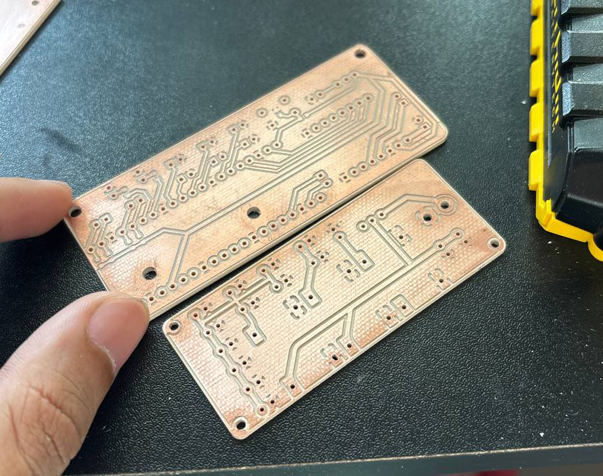
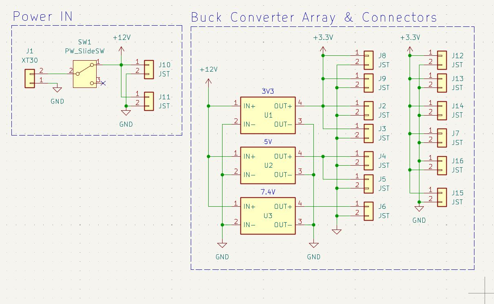

# WRO Future Engineers 2025 – Team Barakah Brigade

>_"Machines may move, but minds make them meaningful."_


## I. The Chronicle Begins

Welcome to the official documentation of **Team Barakah Brigade**, proudly representing **Bangladesh** in the **WRO Future Engineers 2025** challenge. Our machine is not only a competition entry — it's a product of relentless design, weekend solder burns, deep debugging sessions, and the shared dream of building something that _knows what to do_ when left alone.


## II. The Machine: Purpose, Not Parts

Our vehicle is modular, intelligent, and ever-adapting. It uses a hybrid sensor approach to interpret its surroundings and make autonomous driving decisions in real-time — under the constraints and chaos of a real track.

### Core Concepts:

- **Multi-sensor Fusion**: For reliable perception, redundancy, and adaptation.
- **Real-time RTOS Decision Engine**: Powered by RT-Smart, giving predictable, scheduled execution for safety and speed. Providing an environment 
- **Microcontroller Offload Architecture**: Peripheral-heavy sensor reading offloaded to a C-programmed sensor hub board.
- **PWM-driven Motion**: Real-time speed and torque adjustments via software PWM on hardware-level pins.
- **Visual Processing Backbone**: Using the OV5647 camera as the main eye of the vehicle.
- **Machine Learning assisted motion**: Following the current trends, and picking up with the modern pace, ML assisted motion brings us the edge of driving and transportation technology with automation and reliablity

---
## Table of Contents

- [III. The Team](#iii-the-team)
- [IV. Mechanical Subsystem](#iv-mechanical-subsystem)
  - [Drive Train](#drive-train)
  - [Steering](#steering)
  - [Wheel Base](#wheel-base)
  - [Top and Base](#top-and-base)
  - [Camera Mount](#camera-mount)
- [V. Electrical Subsystem](#v-electrical-subsystem)
  - [Hardware Component Overview](#hardware-component-overview)
  - [CanMV K230 — The Heart of the Project That Brings Everything to Life](#canmv-k230--the-heart-of-the-project-that-brings-everything-to-life)
  - [K230 vs Raspberry Pi: Why We Preferred the K230](#k230-vs-raspberry-pi-why-we-preferred-the-k230)
  - [Custom PCBs](#custom-pcbs)
    - [(A) MCU Carrier Board](#a-mcu-carrier-board)
    - [(B) Power Distribution Board (PDB)](#b-power-distribution-board-pdb)
  - [Sensor Modules & Specifications](#sensor-modules--specifications)
    - [Reasoning behind choosing ToF Over Ultrasonic Sensors](#reasoning-behind-choosing-tof-over-ultrasonic-sensors)
    - [How we tackled problems while sensor calibration and debugging](#how-we-tackled-problems-while-sensor-calibration-and-debugging)
      - [Problem](#problem)
      - [Analysis](#analysis)
      - [Solution and Process](#solution-and-process)
    - [How it works at low level](#how-it-works-at-low-level)
    - [Other Active Modules](#other-active-modules)
      - [TCA9548A](#tca9548a)
      - [16GA 800RPM Motor](#16ga-800rpm-motor)
      - [JX-6221-MGI Servo](#jx-6221-mgi-servo)
- [VI. Software Subsystem](#vi-software-subsystem)
  - [Overview (Open Challenge)](#overview--open-challenge-)
    - [Approach](#approach)
    - [Data Collection](#data-collection)
    - [Model Training](#model-training)
    - [Conclusion](#conclusion)


## III. The Team

| Name                  | Role                        | Focus Areas | Picture |
|-----------------------|-----------------------------|-------------|---------|
| **Sadnan Adib Khan**  | Team Lead                   | Strategy, PCB design, Mechanical layout & Power Systems | |
| **Alif Ilhan**        | Embedded Systems     | Firmware, Electrical design, Low Level-Sensor Integration and bringup |  |
| **Azmain Inqiad Adib**| AI & Algorithm Architect    | Machine Learning, Decision making, and camera vision processing |  |


---


# IV. Mechanical Subsystem
[Drive Train](#drive-train) · [Steering](#steering) · [Wheel Base](#wheel-base) · [Top and Base](#top-and-base) · [Camera Mount](#camera-mount)
---

|  | | 
| :--: | :--: | 
| *Top* | *Right* |


Initially due to the lack of time and considering when we started working on the project we didn’t have much room to play around with the choice of components or mechanics. What we thought would work best theoretically wasn’t always the case, but we’re still satisfied with the hardware of the car but there’s much room for improvement. A few of the components we bought off the shelf which didn’t have CAD models available had to be modeled in CAD from precise measurements so that we could design around them efficiently.


## Drive Train

>Rear ***Open Differential*** from an RC car, ***16GA 800RPM motor*** 

We initially considered using a front-wheel drive with a front differential but chose a rear differential design for less complexity and better compatibility with our custom steering assembly. Instead of designing one from scratch, since 3D printed gears would wear out quickly and be bulkier, we opted for an off-the-shelf open differential from an RC car vendor. We went with a unit that used metal bevel gears, making it more reliable.

|| 
| :--: | :--: | 
| CAD | After Assembly |


 The drawback was that we couldn’t adjust its width, so the overall width of the car was fixed by the differential.
Even though there wasn’t any documentation available, by testing we determined that this differential had a ***built-in gear reduction of 2.5:1*** which **cut our motor speed to less than half of its original output.** At one point, we even considered removing the differential altogether to prioritize speed, but the reliability it provided during cornering was unmatched, so we ultimately decided to keep it. How we worked on improving speed will be discussed in a later section.

The motor was fixed down to the base using a custom motor mount and ***M2 Hardware***, and connected to the differential through a ***universal coupler*** joint, which allowed for slight misalignments between the shafts and reduced the risk of stress or bending.


### Potential Upgrades
- Use a LEGO differential due to it's compact nature (speculation)
- Shift to a BLDC motor or a custom gearbox 

## Steering
A ***modified version of the Ackermann steering*** that provides ***upto 64°*** of rotation from the zero position


Our main goal was to make an Ackermann steering system with tighter turning ability than standard ones. But we soon found out that the metal steering knuckles we had, due to their fixed geometry, did not allow us to achieve a positive Ackermann percentage. Although true Ackermann steering would have reduced tire slip during tight turns, the geometry of our available knuckles limited us to a near ***parallel*** or rather an unintended ***Anti-Ackermann*** setup.

This compromise was acceptable for us since the car primarily operates at moderate speeds on smooth surfaces, where tire scrub has minimal impact. We did not want to 3D print the steering knuckle, as it had to bear most of the lateral loads during the tighter turns, so we decided to design around it. This wasn’t by choice, but a compromise we had to make to work with the hardware available.

| | | 
| :--: | :--: | 
| GIF | Isometric View |

We took an approach to design most of the joints for the steering assembly using a **ball-socket mechanism**, which gave us some room for error and tolerance while designing. We had to print this joint multiple times to make sure the fit had minimal play but still rotated freely. A custom servo horn then allowed us to connect the tie rods and move both sides symmetrically.

### Potential Upgrades
- Using custom steering knuckles
- Switch to off the shelf ball socket joints
- Design a better mounting system


## Wheel Base


It’s apparent from the design that the front and rear wheels have different diameters. This was intentional to recover some of the speed lost to the differential’s reduction. We kept the front wheels smaller to preserve steering clearance and a large steering angle.

> **Front wheel (6)** Diameter: ***40mm*** <br>
> **Rear wheel (17)** Diameter: ***60mm***

| Formula          | Where |
|------------------|-------|
| $v = r \omega$   | $v$ = linear velocity <br> $r$ = radius <br> $\omega$ = angular velocity |

Very self explanotory how ***increasing the wheel radius ($r$) increased the car’s speed ($v$).*** The drawback was that, given the relatively low-torque motor, the car sometimes struggled to pick up speed from a stall position, especially considering its weight. However, this was not a major issue in practice, since during runs the car mostly operates at a near-constant velocity once in motion.


|  |  | 
| :--: | :--: | 
| Silicone wheel covers used in a previous project | Cricket Bat - Wheel Grips |


As for the wheels Grips, we had experience making silicone wheels by casting them in 3D printed molds, but it was difficult to achieve thin and uniform silicone covers. Due to time constraints, we decided to try what was already being used in the local RC car and line-follower robot community — ***Cricket bat grips***. To our surprise, the material worked perfectly. Our silicone covers tended to attract a lot of dust and quickly lose grip even on relatively clean surfaces, but the rubber grip material provided consistent traction and much better reliability.

### Potential Upgrades
- Having a more uniform diameter between the rear and front wheels would have prevented several issues we later faced—such as needing to account for the tilt when adjusting the TOF sensors. This issue was eventually solved and will be discussed in a later section.

## Top and Base

|  |  | 
| :--: | :--: | 

The entire structure of the **top (5)** and the **base (6)** was edited dozens of times, so the current iteration is somewhat patched together as we built on top of the original design. It went through multiple sensor mount shifts and other modifications. Larger cutouts were kept strategically for minimal cable clutter, easier routing, and to reduce overall weight. The **top (5)** and the **base (6)** are connected using ***20 mm brass hex spacers (4)***, with additional ***3D printed spacers (3)*** used alongside the brass hardware to reach the required height. The mounts for the TOF sensors are built directly into the **top (5)** while this left less room for later adjustments, the layout was finalized after extensive iterations and worked reliably for our needs.

### Potential Upgrades
- There is still a lot of room for improvement. After finalizing the design, this should be remade from scratch while taking inspiration from the current version. The current iteration contains excess geometry and structural clutter. A future redesign from scratch, while reflecting on lessons from this version, would allow for a cleaner and more efficient structure.


## Camera Mount


We did not follow any strict constraints or dimensions while designing the camera mount. The curved shape of the structure was inspired by the **horn of a horned beetle**, while the main focus was on making it sturdy and incorporating a **pivotable(9)** joint for the **camera(2).**


### Potential Upgrades
- Change the mounting system that attaches to the top of the car.
- Upgrade the camera mount and pivot system.
---

# V. Electrical Subsystem

[Hardware Component Overview](#hardware-component-overview) · [CanMV K230](#canmv-k230--the-heart-of-the-project-that-brings-everything-to-life) · [K230 vs Raspberry Pi](#k230-vs-raspberry-pi-why-we-preferred-the-k230) · [Custom PCBs](#custom-pcbs) · [Sensor Modules](#sensor-modules--specifications) · [Other Active Modules](#other-active-modules)
---


The Electrical Subsystem includes all components ranging from sensors to processing boards, along with the supporting electronics used in the build. Issues faced during development and their solutions are discussed in a separate section.

### Hardware Component Overview


| Module              | Description |
|---------------------|-------------|
| **Mainboard** | `01Studios CanMV K230` powered by kendryte chips for most of the heavylifting, running Python, Machine learning models for high-level logic |
| **Sensor Hub**      | A custom PCB housing the `ESP32-S3-Pico` microcontroller running ESP-IDF V5.5.1 managing all the sensors and UART communication with mainboard |
| **Drive System**    | Drive control is handled by the `TB6612FNG` motor driver, using PWM to drive the 16GA motor. |
| **Power Delivery**  | Power is managed through a custom distribution board that delivers clean and regulated ***3.3V, 5V,*** and ***12V*** rails across the electrical system. |
| **Steering System** | The custom Steering Assembly is driven by the well-regarded `JX PDI-6221MG` servo. |


## CanMV K230 — The Heart of the Project That Brings Everything to Life

Our project requires vision processing, Deep Learning capabilities, and a rich programming environment for seamless operation of the car. `Raspberry Pi` was an option, however, its lack of dedicated hardware acceleration for AI and deep learning was a sore thumb. After searching around the market for options like `Jetson Nano(🤑)`, we found this `01Studios CanMV K230 board` which had dedicated hardware accelerators for AI and vision, and also had a rich programming interface through CanMV IDE from the vendor, and all of that in a very affordable price. And on top of that the documentation was very elaborate and helped us get started very quickly.

 |  | 
| :--: | :--: | 

Setting up the board was very simple. We only had to flash the vendor supplied image to an sdcard with `rufus.exe` and put the card into the sdcard slot of the board.
Full elaborate documentation and resources from vendor is available [here](https://wiki.01studio.cc/en/docs/category/canmv-k230套件介绍)

| Specification    | Details                                                                 |
|------------------|-------------------------------------------------------------------------|
| Name             | 01Studios Kendryte K230 Development Board                               |
| RAM              | 2GB LPDDR4                                                              |
| AI Acceleration  | Kendryte’s unique `KPU` (Kendryte Processing Unit)                      |
| Ports            | 1x USB-A, 1x USB-C (power & programming), 1x HDMI, 1x SDCard slot       |
| GPIO             | 40, compatible with Raspberry Pi                                        |
| TDP              | 20W max                                                                 |
| Camera           | Upto 3 camera interfaces                                                |


## K230 vs Raspberry Pi: Why We Preferred the K230
> Simple reason, The **KPU 🤡**


The ``Raspberry Pi`` as said before lacks a dedicated AI Accelerator, which has an option to be separately bought but that raises both design firmware bringup complexity. Also the added ``70TOPs`` performance was an overpriced overkill so, we chose the K230. Its KPU gives an equivalent to ``6TOPS`` NPU performance, which is perfect for ours and the vast majority of AI enabled embedded projects.

| Specification              | Details                                                                 |
|-----------------------------|-------------------------------------------------------------------------|
| Subsystem                   | KPU (Kendryte Processing Unit)                                          |
| Data Types                  | Supports INT8 and INT16                                                 |
| Weight Optimization         | Weight sparse compression                                               |
| Performance (Typical)       | ResNet-50 ≥ 85 fps @ INT8<br>MobileNet_v2 ≥ 670 fps @ INT8<br>YOLOv5s ≥ 38 fps @ INT8 |
| Framework Support           | TensorFlow, PyTorch, TFLite, PaddlePaddle, ONNX                        |
| Toolchain & Profiling       | Quantization toolchain, profiling tools                                 |
| Quantization Accuracy Loss  | < 1%                                                                    |


## Custom PCBs
To keep the vehicle clutter-free and make debugging easier, we resorted to custom PCBs which also allowed for more reliable connections. These were designed in KiCad and later CNC milled. All of them were single layered boards for the ease of manufacturing.
>- **(A)** Microcontroller Carrier Board Housing the ESP32-S3-Pico and the motor Driver.
>- **(B)**  Power Distribution Board with regulated ***3.3V, 5V,*** and ***12V*** supplies.


|  |  | 
| :--: | :--: | 
| (A) MCU Carrier Board | (B) PDB |
|  |  | 
| Things that make a man happy | Snacks |

### (A) MCU Carrier Board


### (B) Power Distribution Board (PDB)
Instead of designing our own voltage regulators, we used **fixed-voltage buck converters** for convenience. The main power comes from a ***12V lithium-polymer battery*** and is distributed through multiple **JST headers**, They were chosen to maximize modularity, flexibility, and ease of repair.




## Sensor Modules & specifications


| Name     | Type              | Communication | Range   | Purpose                                                                 | Picture |
|----------|-------------------|----------------|---------|-------------------------------------------------------------------------|---------|
| TCS34725 | RGB color sensor  | I2C            | –       | Calculate the amount of laps taken.                                     | |
| VL53L1X  | ToF sensor        | I2C            | 4–400cm | Calculate distance of the closest obstruction. Can sample @ 50 Hz, suitable for high-velocity operation without loss of accuracy. |    |
| OV5647   | CSI camera module | MIPI CSI       | 120°    | Main vision of the car system. Detects objects and artifacts, sending data to be processed. |  |

### Reasoning behind choosing ToF Over Ultrasonic Sensors

In all honesty, ultrasonic sensors were a very good alternative — in some cases, maybe even better than our ToF sensors. However, we wanted full control over how our car perceived its environment, which meant having full control over the sensors we were using. With ultrasonics, there was no way to visualize or modify the region of interest, and we had little control over the spread of the sound waves.

With ToF sensors, however, we discovered a simple but ingenious solution (discussed here) that became a real game changer. On top of that, we had much more low-level control thanks to the availability of the [official API manual](https://www.st.com/resource/en/user_manual/um2356-vl53l1x-api-user-manual-stmicroelectronics.pdf)


In our case, the ability to configure the ***ROI (Region of Interest)*** played a significant role. By narrowing the ROI, the sensor focused on the track directly ahead, reducing noise from peripheral objects, while widening it allowed for broader awareness when needed. Since the walls were painted matte black, **a smaller ROI produced a more concentrated beam that returned more photons, helping the readings remain accurate even on such a low-reflectivity surface.**

### How we tackled problems while sensor calibration and debugging 
#### Problem:
ToF sensor positioning and tilt angles were initially misaligned, resulting in unstable and incorrect distance readings during test runs. The libraries we used were forked from ESP-IDF-LIB repos and adapted for the WRO track, but this meant that both hardware and software calibration was needed. This consumed a significant amount of testing time.


#### Analysis:
ToF sensors use infrared (IR) light to measure proximity, and calibration is not straightforward. Although ROI (Region of Interest) settings can be tuned in firmware, they don’t solve the problem of physical misalignment. If the sensor was tilted incorrectly, we would get unreliable values or sometimes no readings at all. At first, we tried multiple tilt angles and calibration combinations, but this trial-and-error approach was time-consuming.

#### Solution and Process

Since the sensors work by emitting IR, we needed to visualize where the IR light was reflecting. CCD-based webcams are sensitive to IR, so we modified one by removing its **IR-Cutoff Filer**. 


This allowed us to directly observe the ToF IR emission patterns and how they reflected off surfaces. Using this method, we could finally align the sensors accurately with the track.

### How it works at low level

Our initial plan to keep the system as a single processing unit was discarded in favor of a sub-controller approach. Instead of spending CPU cycles on polling, converting, and calculating sensor data, the `ESP32-S3-Pico dev boards` were tasked with handling sensor input. 

The sensors were initialized and communicated with through **I2C**. `VL53L1X` ToF sensors were chosen as the primary sensors due to their longer range, higher sensitivity, and quick responsiveness. Although their addresses can be changed using XSHUT pins in case of address conflicts, we opted to use a `TPCA9548A I2C multiplexer` to reduce design complexity.

Data from the ToF sensors was gathered in a continuous looping task using the rich features of the **ESP-IDF v5.5.1** framework for the microcontroller. The sensor data was stored in a global variable, ready to be transferred to the main board on demand, as shown in the following code:

```c
/* Initialise the sensors */
void app_main()
{
    ESP_ERROR_CHECK(i2cdev_init());
    tca9548_init_desc(&i2c_switch, 0x70, 0, CONFIG_I2C_MASTER_SDA, CONFIG_I2C_MASTER_SCL);

    const uint8_t channels[4] = {0,4,3,5};
    for(int i=0;i<4;i++){
        tca9548_set_channels(&i2c_switch, BIT(channels[i]));
        vl53l1x_arr[i] = vl53l1x_config(0, CONFIG_I2C_MASTER_SCL, CONFIG_I2C_MASTER_SDA, -1, 0x29, 0);
    }
    for(int i=0;i<4;i++){
        tca9548_set_channels(&i2c_switch, BIT(channels[i]));
        vl53l1x_init(vl53l1x_arr[i]);
        vl53l1x_setROISize(vl53l1x_arr[i], 4, 4);
        //vl53l1x_stopContinuous(vl53l1x_arr[i]);
        vl53l1x_startContinuous(vl53l1x_arr[i], 20000); // 50Hz
    }

    tca9548_set_channels(&i2c_switch, 7);
    TCS_init(TCS, 0, CONFIG_I2C_MASTER_SDA, CONFIG_I2C_MASTER_SCL);
    init();
    motor_init();
    xTaskCreatePinnedToCore(uart_slave_task, "uart_slave_task", configMINIMAL_STACK_SIZE * 3, NULL, 5, NULL, 0);
    xTaskCreatePinnedToCore(sensor_task, "sensor_task", configMINIMAL_STACK_SIZE * 3, NULL, 5, NULL, 1);
}

```

The function `xTaskCreatePinnedToCore` was used to create two simultaneously running tasks: `uart_slave_task` and `sensor_task.` This allowed the system to continuously gather data from the sensors while also responding to external requests. The sensor data is collected by-

```c
void sensor_task(void *pvParameters)
{
    float r = 0.0f, g = 0.0f, b = 0.0f;
    while(1)
    {
        tca9548_set_channels(&i2c_switch, BIT(3));
        vl53_distances[1] = vl53l1x_readSingle(vl53l1x_arr[1], 1); //right

        tca9548_set_channels(&i2c_switch, BIT(4));
        vTaskDelay(pdMS_TO_TICKS(10));
        vl53_distances[0] = vl53l1x_readSingle(vl53l1x_arr[0], 1); //Left

        tca9548_set_channels(&i2c_switch, BIT(5));
        vl53_distances[2] = vl53l1x_readSingle(vl53l1x_arr[2], 1); //front

        tca9548_set_channels(&i2c_switch, BIT(0));
        vl53_distances[3] = vl53l1x_readSingle(vl53l1x_arr[3], 1); //Back


        tca9548_set_channels(&i2c_switch, BIT(7));
        getlap(TCS, r, g, b);
        vTaskDelay(pdMS_TO_TICKS(10));
    }
}
```
The task is responsible for saving the information about the surroundings from ToF sensors and the color sensor for a sense of surrouding and counting laps. The output is saved in global variables and is waiting to be sent to the **master**.

The MCU board waits for commands from the main board. When a command is received, it reads the current sensor data from the global variables and stringifies it for transmission over UART. This approach was chosen for its simplicity and flexibility. Debug commands were left in place for each individual sensor, with an additional ALL command to request data from all sensors at once.

Full control over the driver motors is achieved through the `MF %d` and `MB %d` commands, where **MF means Motor Forward** and **MB means Motor Backward**. Each command expects a value between 0–100, representing the motor speed as a percentage. And sends a response to the well documented **TB6612FNG** using one PWM pin and Two direction control GPIOs. 

### Other Active Modules


| Component          | Details                                                                 | Image |
|--------------------|-------------------------------------------------------------------------|-------|
| TCA9548A           | I²C multiplexer, acts as the central hub for all onboard sensors        |  |
| 800RPM 16GA Motor |DC motor, used for vehicle propulsion and reliable drive    |  |
| JX-6221-MGI Servo  | Precision servo motor, used to drive and control the steering system    |  |

#### TCA9548A

We deliberately ensured that all our sensors communicated over the **I²C** protocol to avoid a tangled mess of wiring. The **TCA9548A multiplexer** was securely mounted under the K230 board, with all sensor cables neatly routed to their respective channels for organized and reliable communication.


#### 16GA 800RPM Motor

This motor proved to be very reliable, but its performance in our design was somewhat constrained. We overlooked the effect of the gear reduction and torque split at the differential, which meant the motor delivered only the minimum torque required for our application. To compensate, we increased the rear wheel diameter to recover some speed, and in future iterations we may consider slightly overvolting the motor or selecting a higher-torque alternative. Despite this limitation, the current setup has been sufficient for stable operation and provided valuable insight into drivetrain sizing.


### JX-6221-MGI Servo


Even though it may seem like overkill to use such a heavy-duty servo in a build like this, its accuracy and reliability far outperformed the smaller 9g alternatives. **At 6 V, it is rated for 0.16 s/60°**, and by running it on a clean **7.4 V supply** we were able to achieve even faster response times without compromising stability. 


# VI. Software Subsystem
[Overview](#overview--open-challenge-) · [Approach](#approach) · [Data Collection](#data-collection) · [Model Training](#model-training) · [Conclusion](#conclusion)
---
## Overview ( Open Challenge )
The car is controlled by a deep learning model trained using collected data from our trial runs to autonomously navigate through the track in the **WRO Open Challenge**

The car estimates its surrounding environment, and calculates its speed and required `steering angle` based on the proximity data from Time of Flight sensors and Neural Network on its chassis to navigate through the track and evade walls and obstacles.

---

## Approach
- Collect sensor data (`left`, `right`, `front`) from the ToF sensors while driving the car.  
- Record the **executed steering values** alongside sensor readings.  
- Augment the dataset with mirrored driving data.  
- Train a **deep learning regression model** to predict steering commands.  
- Deploy the trained model to a **K230 CanMV board** by converting to `.tflite` and `.kmodel` formats.  

---

## Data Collection


Example dataset:

```csv
left,right,front,steering
516.0,458.0,1719.0,3.0
516.0,463.0,1729.0,-2.0
508.0,463.0,1729.0,-7.0
```

**Left, Right, Front**: ToF sensor readings (distance values).

**Steering**: Control signal sent to the steering motor (in degrees).

The servo can rotate **270 degrees from its base position**, or **-135 to 135 degrees**. Our custom steering needs o**nly -22 to 22** to achieve reliable steering performance covering approximately 150 degrees. M**aximum steering angle recommended is -23 and 23** to avoid damage to the steering mechanism. It is strongly recommended to set **thresholds to the steering function from -22 to 22 or lower** to ensure safe steering.

```c
// Steering Function (mapped duty cycle)
void Servo(PWM servo, float angle) {
    // Map angle (-90~90) to duty (2.5~12.5)
    float duty = (angle + 90) / 180 * 10 + 2.5;
    servo.duty(duty);
}
```

**Data Augmentation (Mirrored Driving)**

When you only drive clockwise (or anticlockwise), you can generate mirrored data to simulate the opposite direction:

```python
df_mirrored = df.copy()  
df_mirrored[["left", "right"]] = df_mirrored[["right", "left"]].values
df_mirrored["steering"] = -df_mirrored["steering"]  

df = pd.concat([df, df_mirrored], ignore_index=True)
print("Augmented dataset shape:", df.shape)
```
This doubles our dataset and ensures the model learns symmetry. Data is collected in ``.txt`` format because the CanMV’s python implementation cannot generate and save data into a CSV file without taking major hurdles hence it is more feasible to convert it using utilities available online or methods like an example script added below:

```python
import pandas as pd

    # Assuming a space-delimited text file
    df = pd.read_csv('openclock2.txt', sep=r'\s+') 
    df.to_csv(‘penclock2.csv', index=False)
```

**Note:** This is barebones example is provided. Please adapt it according to requirement. Please look into the source code to see our implementation.


## Model Training

We used Google Colab for training:
Here is the attached ipynb file
<@AZMAIN ATTACH THE IPYNB FILE OF MODEL TRAINING>

**Required Libraries**
```python
import pandas as pd
import numpy as np
from sklearn.model_selection import train_test_split
from sklearn.preprocessing import StandardScaler
import tensorflow as tf
from tensorflow import keras
from tensorflow.keras import layers
```

**Preprocessing**

We restrict steering values to range [-22, 22] as per safety requirements of the steering mechanism and normalize to [-1, 1] for training:

```python
X = df[["left", "right", "front"]].values
y = df["steering"].values

# Scale steering
y = y / 22.0
```

Split dataset:

```python
X_train, X_test, y_train, y_test = train_test_split(
    X, y, test_size=0.2, random_state=42, shuffle=True
)

scaler = StandardScaler()
X_train = scaler.fit_transform(X_train)
X_test = scaler.transform(X_test)
```

**Deep Learning Model**
```python
model = keras.Sequential([
    layers.Input(shape=(X_train.shape[1],)),
    layers.Dense(32, activation="relu"),
    layers.Dense(32, activation="relu"),
    layers.Dense(16, activation="relu"),
    layers.Dense(1, activation="linear",
                 kernel_initializer="glorot_uniform",
                 bias_initializer="zeros")
])
```

**Explanation of Components**

- **ReLU (Rectified Linear Unit)** → f(x) = max(0, x)
  - Prevents negative activations, introduces non-linearity, avoids vanishing gradients.
- **Linear Activation (Output Layer)** → No transformation, keeps continuous range (for regression).
- **Glorot Uniform (Xavier Initialization)** → Distributes weights with controlled variance to stabilize training.
- **Bias Initializer = Zeros** → Ensures biases start neutral (no favoritism in predictions).

**Model Compilation**
```python
model.compile(
    optimizer=tf.keras.optimizers.Adam(learning_rate=0.001),
    loss=tf.keras.losses.Huber(),
    metrics=["mae"]
)
```

**Why These Choices?**

- **Adam Optimizer** → Adaptive learning rates for each parameter, faster convergence.
- **Huber Loss** → Less sensitive to outliers than MSE; combines MSE & MAE behavior.
- **MAE (Mean Absolute Error)** → Easy-to-interpret metric for regression (average absolute difference).

**Training**
```python
history = model.fit(
    X_train, y_train,
    validation_data=(X_test, y_test),
    epochs=500,
    batch_size=32,
    verbose=1
)
```

Epochs = 500 (you can adjust).

Batch size = 32 → Balanced mini-batch size.

Sample log:
```
Epoch 28/500
575/575 ━━━━━━━━━━━━━━━━ 2s 2ms/step 
loss: 0.0250 - mae: 0.1687 - val_loss: 0.0245 - val_mae: 0.1637


```

**Model Conversion**

Convert to TFLite for deployment:

```python
converter = tf.lite.TFLiteConverter.from_keras_model(model)
converter._experimental_lower_tensor_list_ops = True
converter.experimental_enable_resource_variables = False

tflite_model = converter.convert()
```

Then convert .tflite → .kmodel for CanMV K230 deployment.

**Converting from TFLite to Kmodel**

The CanMV K230 Board uses a specific kmodel format to load and run it’s kmodels and we need to use kendryte’s [nncase compiler](https://www.kendryte.com/k230/en/v1.5/01_software/board/ai/K230_nncase_Development_Guide.html). The compile environment is a Docker installation of Ubuntu 20.04 with necessary dependencies, so you need to install docker into your system. Procedure to set up the environment for compilation:-

```cmd
/* Get the K230 SDK. */
$ git clone https://github.com/kendryte/k230_sdk.git

/* build the dockerfile for docker */

$ cd k230_sdk

/* Pull all necessary components for nncase
$ make prepare_source
```
Now that it is ready, we need to copy the model.tflite to `k230_sdk/src/big/nncase/examples/models/model.tflite`

Now we can continue on the build process:-
```
$ sudo docker build -f tools/docker/Dockerfile -t k230_docker tools/docker

$ sudo docker run - root -it -v $(pwd):$(pwd) -v $(pwd)/toolchain/:opt/toolchain 
-w $(pwd) k230_docker/bin/bash

root@i650j345# pip install nncase nncase-kpu /* Need to do this everytime */
root@i650j345# cd src/big/nncase/examples
root@i650j345# python3 ./scripts/1.py —target k230 —model ./models/model.tflite
```
> **Note:** We provided a 1.py script which must be used, default official scripts will not work

The `steering.kmodel` will be created in `tmp/steering`. Copy it and paste it to K230 board’s sd card’s root directory. You are ready to play around with it.


## Conclusion

- We collected sensor-steering pairs.
- Augmented dataset using mirroring.
- Trained a 3-layer neural network with ReLU activations.
- Used Adam + Huber Loss + MAE for stable regression.
- Deployed to K230 CanMV after converting to .kmodel.

The above pipeline enables our robot to navigate the path and precise steering control in accordance with trained data.

## Overview ( Obstacle Challenge )

As of 20/09/2025, we have not been able to sufficiently work on the obstacle round and parking algorithm due to our ongoing university examinations, after which we will be able to dedicate time to implementing and testing the respective algorithms. Therefore, no working code or further documentaion is available for presentation at this stage.


